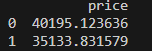
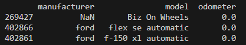

# Parser_cars
 
 ## Оглавление

* [Описание проекта](#описание-проекта)
    * [Основные возможности](#основные-возможности)
    * [Как это работает?](#как-это-работает)
    * [Предварительные требования](#предварительные-требования)
    * [Установите зависимости](#установите-зависимости)
* [Скрипты проекта](#скрипты-проекта)
* [Основные скрипты](#основные-скрипты)
    * [main.py](#mainpy)
* [Вспомогательные скрипты](#вспомогательные-скрипты)
    * [general_function.py](#generalfunctionpy)
* [Цель проекта](#цель-проекта)

## Описание проекта

Этот проект отвечает на 6 вопроса заданных в этом уроке(3 из них выводится и 3 закомментированы):

1. Что дешевле, БМВ или Мерседес после 2018 года выпуска в среднем в каталоге ?
2. Что дешевле, Ауди или Вольво, выпущенные после 2017 года в среднем в каталоге ? 
3. Найти топ 3 модели автомобилей разных марок, выпущенных после 2020 года, с самым большим пробегом, которые есть в каталоге.
4. Найти топ 3 автомобилей, выпущенных после 2018 года, с самым маленьким пробегом, которые есть в каталоге.
5. Сколько Мерседесов входит в топ-100 самых дорогих машин в каталоге ?
6. Сколько Ауди входи в топ 100 самых дорогих автомобилей в каталоге ?

### Основные возможности

В этих 3 функциях:

**Find_out_what_cheaper(df)**

Отвечает на вопросы:

1. Что дешевле, БМВ или Мерседес после 2018 года выпуска в среднем в каталоге ?

2. Что дешевле, Ауди или Вольво, выпущенные после 2017 года в среднем в каталоге ? 

**Get_cars_high_mileage(df)**

Отвечает на вопросы:

1. Найти топ 3 модели автомобилей разных марок, выпущенных после 2020 года, с самым большим пробегом, которые есть в каталоге.

2. Найти топ 3 автомобилей, выпущенных после 2018 года, с самым маленьким пробегом, которые есть в каталоге.

**Сol_mers_very_expensive(df)**

Отвечает на вопросы:

1. Сколько Мерседесов входит в топ-100 самых дорогих машин в каталоге ?

2. Сколько Ауди входи в топ 100 самых дорогих автомобилей в каталоге ?


И 4 функции закомментированных:

**sum_omissions = searching_missing_values(df)**

- Выводит сумму пропущенных значений.

**descriptive_statistics = get_descriptive_statistics(df)**

- Выводит описательную статистику

**calculating_cars_engines(df)**

- Узнаем, какие типы двигателей у автомобилей, представленных в каталоге и сколько машин представлено с каждым из типов двигателя.

**build_scatter_plot(df)**

- Построение графиков

### Как это работает?

### Предварительные требования:

1. Установленный Python версии 3.11 и выше.
2. pip - установщик пакетов Python.

### Установите зависимости

С активированным виртуальным окружением установите зависимости проекта:

```bash
pip install -r requirements.txt
```

## Скрипты проекта:

* [main.py](#mainpy)
* [vehicles.csv](#vehiclescsv)

## Основные скрипты

### main.py

#### Что делает скрипт?

Скрипт выводит ответы на вопросы. И может выводить дополнительную информацию по каталогу.

#### Как запустить скрипт?

```bash
python main.py
```

#### Что выведет скрипт?

При запуске скрипта мы получает такие выводы:

- find_out_what_cheaper(df)

Этот скрипт выведет:



- get_cars_high_mileage(df)

Этот скрипт выведет:



- col_mers_very_expensive(df)

Этот скрипт выведет:


## Вспомогательные скрипты

Следующие скрипты являются вспомогательными и не запускаются отдельно:

### vehicles.csv

Это дополнительный скрипт с каталогом. Его запускать не нужно.

Этот скрипт нужно скачать. Его можно скачать по [ссылке](https://dazzling-caption-fe8.notion.site/csv-ca695565045241148e91024d9489d6fe).

И положите его в файл рядос с main.py.

## Цель проекта

Проект написан в образовательных целях для моей сестры.
